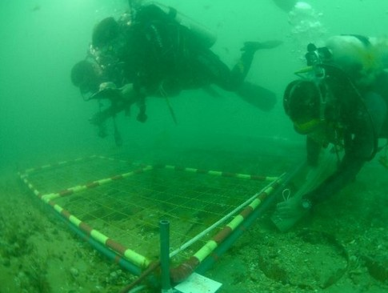

# 🌊 AquaVision — Underwater Image Enhancement (UWIE) System

<p align="center">
  
</p>

<p align="center">
  <b>A deep learning & computer vision platform designed to restore color degradation, wavelength attenuation, haze, and contrast loss in underwater imagery.</b>
</p>

<p align="center">
  
  
  
  
  
</p>

---

## 📌 Table of Contents
1. [Overview](#-overview)
2. [Key Features](#-key-features)
3. [System Architecture](#-system-architecture)
4. [Dataset & Benchmark](#-dataset--benchmark)
5. [Model Architecture & Training](#-model-architecture--training)
6. [Project Structure](#-project-structure)
7. [Installation & Setup](#-installation--setup)
   - [Prerequisites](#prerequisites)
   - [Backend Setup (FastAPI & PyTorch)](#1-backend-setup-fastapi--pytorch)
   - [Frontend Setup (Next.js 15 & React)](#2-frontend-setup-nextjs-15--react)
8. [Environment Variables](#-environment-variables)
9. [API Reference](#-api-reference)
10. [Evaluation Metrics](#-evaluation-metrics)
11. [License](#-license)

---

## 🔍 Overview

Light traveling through water experiences exponential attenuation and scattering due to suspended particles and wavelength-dependent absorption (red light diminishes within 3–5 meters, causing characteristic green-blue casts). 

**AquaVision** solves this degradation through a hybrid approach combining:
1. **AquaVisionNet**: A multi-scale **Residual U-Net** augmented with **Squeeze-and-Excitation (SE) Channel Attention** to dynamically recalibrate color channels.
2. **Classical Pre/Post-processing Fallbacks**: Gray-World White Balance and Contrast Limited Adaptive Histogram Equalization (CLAHE) in the LAB color space.
3. **Real-Time Interactive UI**: A modern Next.js 15 client providing split-screen comparison, live non-reference image quality metrics (UIQM, UCIQE, PSNR), and image history.

---

## ✨ Key Features

- **🚀 Neural Underwater Enhancement**: Residual Attention U-Net restoring realistic color vibrancy and structural clarity.
- **⚡ Fast Inference**: CUDA GPU acceleration with automatic CPU fallback.
- **🛡️ Robust Fail-Safe Pipeline**: Classical CV fallback guarantees output even in cold-start scenarios or corrupted weight states.
- **🎛️ Interactive Comparison Slider**: Real-time before/after slider with zoom, pan, and split-view modes.
- **📊 Scientific Quality Metrics**: Evaluates enhanced images using **PSNR**, **UIQM** (Underwater Image Quality Measure), and **UCIQE** (Underwater Color Image Quality Evaluation).
- **📂 Sample Presets & Session History**: Test instantly with preset underwater samples and browse historical enhancement runs.
- **📝 Project Synopsis Modal**: Built-in architecture overview, methodology details, and dataset information directly accessible in the web app.

---

## 🏗️ System Architecture

```
┌────────────────────────────────────────────────────────┐
│                   Next.js 15 Client                    │
│   (Upload Component, Interactive Split Slider, Metrics)│
└───────────────────────────┬────────────────────────────┘
                            │ HTTP Multipart POST / REST
                            ▼
┌────────────────────────────────────────────────────────┐
│                  FastAPI Backend Server                │
│    (/api/v1/enhance/upload, /history, /info, /health)  │
└───────────────────────────┬────────────────────────────┘
                            │
              ┌─────────────┴─────────────┐
              ▼                           ▼
   ┌───────────────────────┐   ┌───────────────────────┐
   │    AquaVisionNet      │   │  Classical CV Engine  │
   │ Residual U-Net + SE   │   │  CLAHE + White Balance│
   │ (Deep Learning Model) │   │  (Fail-safe Fallback) │
   └───────────────────────┘   └───────────────────────┘
```

---

## 📊 Dataset & Benchmark

AquaVision is trained and benchmarked on the **UIEB (Underwater Image Enhancement Benchmark)** dataset:

- **Dataset Name**: Underwater Image Enhancement Benchmark (UIEB)
- **Source**: [UIEB Official Repository / Paper](https://li-chongyi.github.io/proj_benchmark.html)
- **Content**: 890 paired real-world underwater images captured under diverse oceanic conditions (greenish water, blue haze, low light, deep ocean), paired with high-quality reference ground truths selected by 500+ volunteer evaluations.
- **Data Splitting**:
  - `backend/dataset/train/`: 80% paired samples for neural training (`raw/` and `reference/`).
  - `backend/dataset/val/`: 10% validation images for loss convergence & validation PSNR.
  - `backend/dataset/test/`: 10% test set for qualitative and quantitative benchmarking.

### Dataset Directory Format:
```
backend/dataset/
├── train/
│   ├── raw/           # Raw degraded underwater images
│   └── reference/     # Corresponding reference ground truth images
├── val/
│   ├── raw/
│   └── reference/
└── test/
    ├── raw/
    └── reference/
```

---

## 🧠 Model Architecture & Training

### Architecture Highlights
- **Encoder**: 4 downsampling convolutional stages with Residual blocks and **Squeeze-and-Excitation (SE)** attention modules to reweight red/green/blue channels dynamically.
- **Bottleneck**: Deep residual attention blocks capturing multi-scale context.
- **Decoder**: 4 upsampling stages with skip connections restoring spatial resolution and high-frequency edge details.
- **Loss Function**: Hybrid combination of $L_1$ pixel loss, Mean Squared Error (MSE), and Structural Similarity Index (SSIM):
  $$\mathcal{L}_{\text{total}} = \alpha \mathcal{L}_{1} + \beta \mathcal{L}_{\text{MSE}} + \gamma (1 - \text{SSIM})$$

### Training Command
```bash
cd backend
python training/train.py --dataset dataset/train --val dataset/val --epochs 25 --batch-size 8 --lr 0.0001
```

Checkpoints are automatically saved to `backend/weights/model.pth`.

---

## 📁 Project Structure

```
AquaVision/
├── backend/
│   ├── app/
│   │   ├── main.py                 # FastAPI application entrypoint
│   │   ├── routes/
│   │   │   └── enhancement.py      # REST API routes (upload, history, info)
│   │   ├── model/
│   │   │   ├── model.py            # AquaVisionNet PyTorch neural network
│   │   │   └── inference.py        # Model inference & fallback manager
│   │   └── utils/
│   │       └── image_processing.py  # CLAHE, White Balance, PSNR, UIQM calculation
│   ├── dataset/                    # Training/validation/testing data folders
│   ├── training/
│   │   └── train.py                # PyTorch training script
│   ├── weights/
│   │   └── model.pth               # Model checkpoint weights
│   ├── uploads/                    # Temporary raw image uploads
│   ├── outputs/                    # Processed enhanced outputs
│   ├── requirements.txt            # Python dependencies
│   ├── .env.example                # Backend environment template
│   └── README.md                   # Backend documentation
│
├── frontend/
│   ├── src/
│   │   ├── app/
│   │   │   ├── layout.tsx          # Root layout & meta tags
│   │   │   ├── page.tsx            # Main application UI page
│   │   │   └── globals.css         # Global styling & design system
│   │   ├── components/
│   │   │   ├── Navbar.tsx          # Navigation header & system status badge
│   │   │   ├── ImageUploader.tsx   # Drag-and-drop file upload & sample presets
│   │   │   ├── ComparisonViewer.tsx# Before/after interactive split slider
│   │   │   ├── MetricsPanel.tsx    # Quality metrics (PSNR, UIQM, UCIQE, time)
│   │   │   ├── HistorySection.tsx  # Recent enhancement history gallery
│   │   │   ├── SynopsisModal.tsx   # Project synopsis & technical documentation
│   │   │   └── Footer.tsx          # Application footer
│   │   └── lib/
│   │       ├── api.ts              # API client for backend communication
│   │       └── types.ts            # TypeScript interfaces
│   ├── public/                     # Static assets and sample underwater images
│   ├── package.json                # Frontend dependencies & scripts
│   ├── .env.example                # Frontend environment template
│   └── README.md                   # Frontend documentation
│
├── .gitignore                      # Git exclusion rules
└── README.md                       # Project overview & documentation
```

---

## 🚀 Installation & Setup

### Prerequisites
- **Python 3.9+**
- **Node.js 18+** & **npm**
- **CUDA Toolkit** (Optional, for GPU acceleration)

---

### 1. Backend Setup (FastAPI & PyTorch)

```bash
# 1. Navigate to backend
cd backend

# 2. Create and activate a virtual environment
python -m venv venv

# On Windows:
venv\Scripts\activate
# On Linux/macOS:
source venv/bin/activate

# 3. Install Python dependencies
pip install -r requirements.txt

# 4. Configure environment
cp .env.example .env

# 5. Start the backend server
python app/main.py
```

The backend server runs at **`http://localhost:8000`**.
- Swagger UI Documentation: [http://localhost:8000/docs](http://localhost:8000/docs)
- Health Check: [http://localhost:8000/health](http://localhost:8000/health)

---

### 2. Frontend Setup (Next.js 15 & React)

```bash
# 1. Open a new terminal and navigate to frontend
cd frontend

# 2. Install Node dependencies
npm install

# 3. Configure environment
cp .env.example .env.local

# 4. Start Next.js development server
npm run dev
```

Open **`http://localhost:3000`** in your browser to interact with AquaVision.

---

## ⚙️ Environment Variables

### Backend (`backend/.env`)
| Variable | Default | Description |
|---|---|---|
| `HOST` | `0.0.0.0` | Host IP address for Uvicorn |
| `PORT` | `8000` | Port for FastAPI backend |
| `DEBUG` | `True` | Enable debug logs |
| `UPLOAD_DIR` | `uploads` | Directory for uploaded raw images |
| `OUTPUT_DIR` | `outputs` | Directory for enhanced output images |
| `WEIGHTS_PATH` | `weights/model.pth` | Path to trained model weights |
| `ALLOWED_ORIGINS` | `http://localhost:3000` | Allowed CORS origins (comma-separated) |
| `DEVICE` | `auto` | Execution device (`auto`, `cuda`, `cpu`) |

### Frontend (`frontend/.env.local`)
| Variable | Default | Description |
|---|---|---|
| `NEXT_PUBLIC_API_URL` | `http://localhost:8000` | Base URL of the FastAPI backend server |

---

## 🔌 API Reference

### 1. Upload & Enhance Image
`POST /api/v1/enhance/upload`

**Request:** `multipart/form-data` with key `file` (JPEG, PNG, WEBP).

**Response (200 OK):**
```json
{
  "id": "c604d573",
  "filename": "underwater_sample.png",
  "raw_url": "/uploads/c604d573_raw.png",
  "enhanced_url": "/outputs/c604d573_enhanced.png",
  "timestamp": 1725350400.0,
  "metadata": {
    "method": "AquaVision Deep Learning Neural Network",
    "device": "cuda",
    "original_resolution": "640x480",
    "estimated_psnr": 27.82,
    "uiqm": 3.42,
    "uciqe": 0.61,
    "model_checkpoint_active": true,
    "processing_time_seconds": 0.084
  }
}
```

### 2. Enhancement History
`GET /api/v1/enhance/history`
- Returns recent enhancement sessions for the gallery feed.

### 3. Backend & Device Info
`GET /api/v1/enhance/info`
- Returns GPU device state, CUDA availability, and loaded model weight information.

---

## 📈 Evaluation Metrics

AquaVision evaluates enhancement quality using industry-standard full-reference and no-reference benchmarks:

1. **PSNR (Peak Signal-to-Noise Ratio)**: Measures pixel-level fidelity against ground-truth reference images (higher is better, typically >25 dB).
2. **UIQM (Underwater Image Quality Measure)**: Linear combination of underwater colorfulness (UICM), sharpness (UISM), and contrast (UIConM).
3. **UCIQE (Underwater Color Image Quality Evaluation)**: Evaluates color cast, saturation, and contrast in CIELAB color space.

---

## 📄 License

This project is licensed under the [MIT License](LICENSE).
